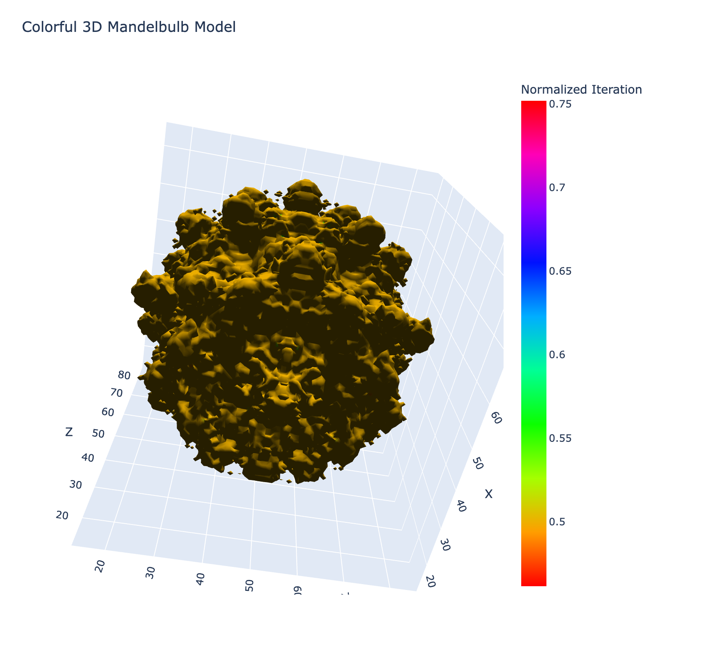

# 2025-02-25

## o3-miniにプログラムを作らせてみる

o3-miniに3Dのフラクタクル図形をプロットするプログラムを作らせてみた。数回書き直させたが以下のようなコードを生成してくれたのでとりあえず満足。

```python
import numpy as np
import plotly.graph_objects as go
from skimage import measure
import scipy.ndimage
import matplotlib.cm as cm

# パラメータ設定
power = 8  # マンデルブロ集合のべき乗
max_iter = 20  # 最大反復回数
bailout = 2  # 発散とみなす閾値
grid_size = 100  # ボリュームデータの解像度

# グリッド生成
x_vals = np.linspace(-1.5, 1.5, grid_size)
y_vals = np.linspace(-1.5, 1.5, grid_size)
z_vals = np.linspace(-1.5, 1.5, grid_size)

# 反復回数（正規化値）を格納するボリュームの初期化
iter_volume = np.zeros((grid_size, grid_size, grid_size), dtype=float)

# 各グリッド点で Mandelbulb の反復計算を実行
for i, x in enumerate(x_vals):
    for j, y in enumerate(y_vals):
        for k, z in enumerate(z_vals):
            c = np.array([x, y, z])
            z_vec = np.array([0.0, 0.0, 0.0])
            iter_count = 0
            while iter_count < max_iter:
                r = np.linalg.norm(z_vec)
                if r > bailout:
                    break
                # ゼロ除算防止
                if r == 0:
                    theta = 0
                    phi = 0
                else:
                    theta = np.arccos(z_vec[2] / r)
                    phi = np.arctan2(z_vec[1], z_vec[0])
                # 極形式でのべき乗計算
                zr = r**power
                theta_new = theta * power
                phi_new = phi * power
                new_x = zr * np.sin(theta_new) * np.cos(phi_new)
                new_y = zr * np.sin(theta_new) * np.sin(phi_new)
                new_z = zr * np.cos(theta_new)
                z_vec = np.array([new_x, new_y, new_z]) + c
                iter_count += 1
            # 内部の点は最大反復回数に近い値、外部は早期発散した値として保存
            iter_volume[i, j, k] = iter_count / max_iter

# Marching Cubes により等値面（level=0.5）を抽出
verts, faces, normals, _ = measure.marching_cubes(iter_volume, level=0.5)

# 各頂点での反復値を補間で取得
vertex_values = scipy.ndimage.map_coordinates(
    iter_volume, [verts[:, 0], verts[:, 1], verts[:, 2]], order=1
)

# 各面の頂点インデックスを取得（Plotly の Mesh3d 用）
i_indices = faces[:, 0]
j_indices = faces[:, 1]
k_indices = faces[:, 2]

# Plotly 用の各頂点座標
x = verts[:, 0]
y = verts[:, 1]
z = verts[:, 2]

# Plotly の Mesh3d では intensity と colorscale を指定することで、
# HSV カラーマップでカラフルな表示が可能です。
fig = go.Figure(
    data=[
        go.Mesh3d(
            x=x,
            y=y,
            z=z,
            i=i_indices,
            j=j_indices,
            k=k_indices,
            intensity=vertex_values,
            colorscale="HSV",
            colorbar=dict(title="Normalized Iteration"),
            showscale=True,
            opacity=1.0,
            lighting=dict(
                ambient=0.18, diffuse=1, fresnel=0.1, specular=1, roughness=0.05
            ),
            lightposition=dict(x=100, y=200, z=0),
        )
    ]
)

fig.update_layout(
    title="Colorful 3D Mandelbulb Model",
    scene=dict(xaxis_title="X", yaxis_title="Y", zaxis_title="Z"),
    width=800,
    height=800,
)

fig.show()
```

できあがり:



## 体調

精神的な状態は芳しくない。昨日久しぶりにコンサータを抜いたら、食事を買いにコンビニまで行った以外はずっと横になって寝ているか、スマホでSNSを見るかぐらいしかできず、ポリタスTVの視聴すらしんどくて出来ない有様だった。今日はコンサータを飲んでいるので、少しはマシになっているが、やはり体調は良くない。仕事から逃げてこんな事をしている始末だ。
